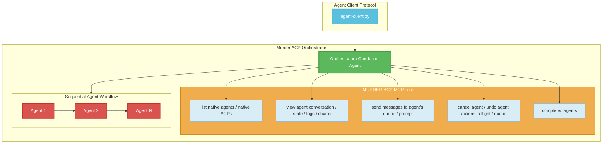

```mermaid
graph TB
    subgraph ACP["Agent Client Protocol"]
        AC["agent-client.py"]
    end

    subgraph ORCHESTRATOR["Murder ACP Orchestrator"]
        O["Orchestrator / Conductor Agent"]
        
        subgraph MURDER_ACP["MURDER-ACP MCP Tool"]
            T1["list native agents / native ACPs"]
            T2["view agent conversation / state / logs / chains"]
            T3["send messages to agent's queue / prompt"]
            T4["cancel agent / undo agent actions in flight / queue"]
            T5["completed agents"]
        end
        
        subgraph WORKFLOW["Sequential Agent Workflow"]
            W1["Agent 1"]
            W2["Agent 2"]
            W3["Agent N"]
            W1 --> W2 --> W3
        end
    end

    O --> T1
    O --> T2
    O --> T3
    O --> T4
    O --> T5
    O --> WORKFLOW
    AC --> O

    classDef protocol fill:#5bc0de,stroke:#31b0d5,color:#fff,stroke-width:2px;
    classDef orchestrator fill:#5cb85c,stroke:#449d44,color:#fff,stroke-width:3px;
    classDef tool fill:#f0ad4e,stroke:#d58512,color:#fff,stroke-width:2px;
    classDef function fill:#d9edf7,stroke:#7fb3d5,color:#333,stroke-width:1px;
    classDef workflow fill:#d9534f,stroke:#c9302c,color:#fff,stroke-width:2px;

    class AC protocol;
    class O orchestrator;
    class MURDER_ACP tool;
    class T1,T2,T3,T4,T5 function;
    class W1,W2,W3 workflow;
```
