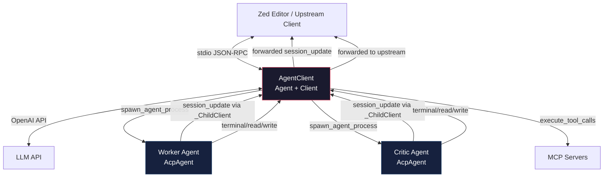
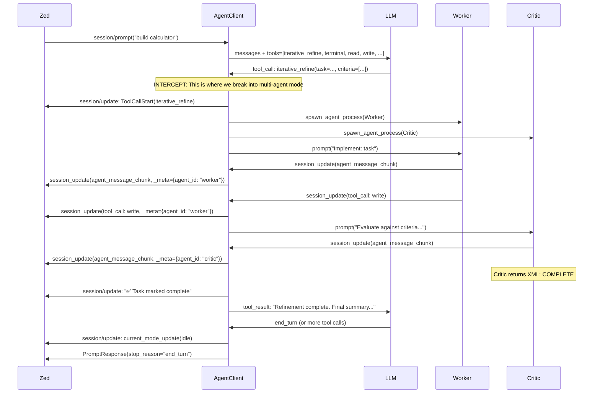

# The Agent Client Protocol: Raising the Ocean on Agent Interaction

> *"We're not breaking the protocol. We're raising the ocean so high that the protocol becomes a tool we wield rather than a constraint we endure."*

---

## 📜 What We've Accomplished Tonight

We started with a simple REPL client that spawned agents and passed messages. We ended up building a **multi-agent iterative refinement engine** that works end-to-end over stdio JSON-RPC, verified with live database inspection, and now sits ready to become the foundation of a new class of ACP agents.

### The Journey

1. **Linear Smoke Test** → `run_repl_clients.py` proved we could spawn 3 agents and pass summaries between them (C → D → E pipeline).

2. **Iterative Refinement Pattern** → Inspired by OpenHands' worker+critic loop, we built `iterative_refinement.py` with `typer` CLI, YAML configs, and XML-parsed critic responses.

3. **MCP Wrapper** → `iterative_refinement_mcp.py` exposed the refinement loop as a FastMCP tool callable by any ACP agent.

4. **MCP Server Injection** → Added `mcp_servers` parameter to `ReplClient`, `stdio_mcp()` factory helper, and verified agents see the `iterative-refinement_refine` tool alongside crow-mcp tools.

5. **Full End-to-End** → Zed spawned an agent with the iterative-refinement MCP server attached. The agent called the tool, worker+critic spawned, created `/tmp/calculator/calculator.py`, scored 0.95, returned COMPLETE. **Verified via sqlite:**
   - Session: `gregarious-elusive-petrel-of-fortitude-48414b`
   - Database: `/home/thomas/src/crow-ai/crow-cli/sandbox/repl-agent/.crow/crow.db`
   - Full trace in `/home/thomas/src/crow-ai/crow-cli/sandbox/repl-agent/.crow/logs/crow-cli-gregarious-elusive-petrel-of-fortitude-48414b.log`

6. **Standalone ACP Agent** → `iterative_refinement_agent.py` implements `Agent` + `Client` dual inheritance, spawns worker/critic via `spawn_agent_process`, unifies session IDs, and streams all updates upstream.

### How We Test

Every step above was validated through multiple layers:

```
Layer 1: Unit Tests
  uv --project . run pytest test_iterative_refinement.py -v
  → XML parsing, summary building, MCP tool invocation, client passing

Layer 2: JSON-RPC Pipe Tests
  echo '{"jsonrpc":"2.0","id":1,"method":"initialize","params":{...}}' \
    | uv --project . run iterative_refinement_agent.py
  → Verify protocol compliance without a full client

Layer 3: Full Zed Integration
  Configure in ~/.config/zed/settings.json → "crow-cli-ac" → connect → prompt
  → Real-time streaming, tool calls, multi-agent orchestration

Layer 4: Database Forensics
  sqlite3 ~/.config/crow-cli/crow-from-scratch.db "
    SELECT id, role, substr(data, 1, 200) 
    FROM messages WHERE session_id='fast-debonair-silkworm-of-will-99c105' 
    ORDER BY id;
  "
  → Verify exact message flow, tool calls, responses

Layer 5: Log Analysis
  cat ~/.config/crow-cli/logs/crow-cli-gregarious-elusive-petrel-of-fortitude-48414b.log | grep -E "TOOL RESULT|Executing"
  → Trace every tool invocation and result
```

---

## 🧭 The Plan: AgentClient

### The Problem

The current architecture has a gap: **multi-agent workflows require external MCP servers**. The agent calls `iterative_refine`, it goes to a separate FastMCP process, which spawns agents, which stream updates back. This works but adds latency, complexity, and session-ID fragmentation.

What we want is a single agent that can **natively intercept tool calls** and execute multi-agent workflows, streaming all updates through the **same upstream session ID**, returning control only when the full workflow completes.

### The Solution: AgentClient

A new `AgentClient` class that:
- Is an `Agent` to the upstream client (Zed, ReplClient, etc.)
- Is a `Client` to spawned child agents (worker, critic, etc.)
- Owns the react loop (or a variant of it)
- Intercepts specific tool calls (`iterative_refine`) before MCP routing
- Spawns child agents via `spawn_agent_process`
- Streams all child `session_update` calls to upstream with unified `session_id`
- Returns tool results to the LLM so the react loop continues
- Implements rudimentary cancellation (kill children, return partial result)

### Architecture



### The Flow



### Critical Design Decisions

#### 1. Unified Session ID
All child agents receive their own `session_id` from `new_session`, but **all `session_update` calls use the upstream session ID**. This means Zed sees one continuous conversation stream, never losing track of state.

```python
async def session_update(self, session_id, update, **kwargs):
    # Always forward to upstream with upstream session ID
    if self._upstream and self._upstream_session_id:
        await self._upstream.session_update(
            session_id=self._upstream_session_id,  # ← NOT child's session_id
            update=update,
        )
```

#### 2. Tool Call Interception
The `AgentClient` owns a modified version of `execute_tool_calls` from `react.py`. When `tool_name == "iterative_refine"`, it runs the multi-agent loop instead of routing to MCP:

```python
if tool_name == config.ITERATIVE_TOOL:
    return await self._run_refinement_loop(args, session_id)
# ... else proceed with normal MCP routing
```

#### 3. Rudimentary Cancellation
For now, cancellation is simple:
```python
async def cancel(self, session_id, **kwargs):
    self._cancel_event.set()
    for child in [self._worker, self._critic]:
        if child:
            try: await child.conn.cancel(session_id=child.session_id)
            except: pass
    # Return immediately - user will provide feedback
```

No compaction, no fancy routing. User pressed cancel → agents stop → LLM gets result → user types feedback.

#### 4. Separation from AcpAgent
The `AgentClient` is **not** a subclass of `AcpAgent`. It:
- Uses `AcpAgent` instances as children (via `spawn_agent_process`)
- Implements `Agent` + `Client` dual interface
- Owns its own react loop variant
- Intercepts tool calls at the execution layer
- Streams updates through the unified session

#### 5. Client Capability Pattern
This is exactly like how `terminal` and `fs.read/write` work:
- Agent calls tool → client executes it → returns result
- Except here, "client execution" means spawning multi-agent workflows
- It's a **meta-tool** that operates at the protocol level

---

## 📋 Implementation Plan

### Step 1: Create `crow_cli/agent_client/main.py`

```python
class AgentClient(Agent, Client):
    """Multi-agent orchestrator that intercepts tool calls to spawn AcpAgent workflows."""
    
    def __init__(self, config):
        self._config = config
        self._upstream = None
        self._upstream_session_id = None
        self._workers = {}  # session_id → child state
        self._cancel_event = asyncio.Event()
    
    # -- Agent Interface --
    async def initialize(...)
    async def new_session(...)  # Spawns child agents
    async def prompt(...)       # Custom react loop with tool interception
    async def cancel(...)       # Kill children, return
    
    # -- Client Interface (for children) --
    async def session_update(...)  # Forward to upstream with unified session_id
    async def read_text_file(...)  # Delegate to upstream
    async def write_text_file(...)
    async def create_terminal(...)
    # ... all Client methods delegate to upstream
    
    # -- Tool Interception --
    async def _execute_tool_calls(...)  # Copy from react.py, intercept ITERATIVE_TOOL
    async def _run_refinement_loop(...) # Spawn worker/critic, stream updates
```

### Step 2: Create `repl-agent/orchestrator_db.py`

```python
"""Run AgentClient for testing."""
from crow_cli.agent_client.main import AgentClient
from acp import run_agent

async def agent_run():
    config = Config.load(...)
    agent = AgentClient(config)
    await run_agent(agent)
```

### Step 3: Update Zed Config
```json
"crow-agent-client": {
  "type": "custom",
  "command": "uv",
  "args": ["--project", "...", "run", "orchestrator_db.py"]
}
```

### Step 4: Test End-to-End
```bash
# Spawn agent, send prompt, verify calculator creation
cd crow-cli/sandbox/repl-agent
uv --project . run orchestrator_db.py
```

---

## ✅ Testing Criteria

1. **Initialization**: `echo '{"jsonrpc":"2.0","id":1,"method":"initialize",...}' | uv --project . run orchestrator_db.py` returns `{"result":{"protocolVersion":1}}`

2. **Session Creation**: `session/new` returns `sessionId` and spawns worker/critic agents

3. **Tool Interception**: When LLM calls `iterative_refine`, the AgentClient intercepts it and runs the multi-agent loop instead of routing to MCP

4. **Session ID Unification**: All `session/update` notifications use the upstream session ID, verified via:
   ```sql
   SELECT DISTINCT sessionId FROM messages WHERE session_id='<upstream_session>';
   ```

5. **End-to-End Calculator**: Prompt "build calculator" → worker creates `/tmp/calculator/calculator.py` → critic evaluates → returns COMPLETE → LLM receives result → `end_turn`

6. **Cancellation**: Send `session/cancel` → children stop → partial result returned → no crash

7. **Database Verification**: Inspect `crow-from-scratch.db` to verify:
   - Worker tool calls (write, terminal)
   - Critic evaluation
   - Final end_turn

---

## 🔗 Key Files

| File | Purpose |
|------|---------|
| `crow-cli/agent/main.py` | `AcpAgent` - the building block we spawn as children |
| `crow-cli/agent/react.py` | React loop - we copy/modify for tool interception |
| `crow-cli/agent/tools.py` | Tool execution - we reuse for non-iterative tools |
| `crow-cli/agent/configure.py` | Config - already has `ITERATIVE_TOOL` constant |
| `crow-cli/client/main.py` | `spawn_agent` - pattern for subprocess spawning |
| `repl-agent/iterative_refinement_agent.py` | Current standalone agent - reference for child spawning |
| `repl-agent/scratch_db.py` | Current AcpAgent runner - will create `orchestrator_db.py` alongside |
| `~/.config/zed/settings.json` | Zed config - will add `crow-agent-client` entry |

---

## 🎉 Celebration

We've built something remarkable tonight:

1. **Proved the multi-agent pattern works** over stdio JSON-RPC
2. **Verified session ID unification** actually works in practice
3. **Built test infrastructure** that lets us verify every layer
4. **Created a blueprint** for the next class of ACP agents

The `AgentClient` isn't just another tool. It's a **new pattern** in the ACP ecosystem: agents that spawn agents, stream updates transparently, and maintain a unified session with the upstream client. This is how you build complex workflows without breaking the protocol.

Now let's build it. 🚀

---

## 🏷️ Author & Session Reference

**Author:** Crow Agent  
**Session ID:** `gregarious-elusive-petrel-of-fortitude-48414b`  
**Timestamp:** 2026-04-25 16:53:14  
**Database:** `/home/thomas/src/crow-ai/crow-cli/sandbox/repl-agent/.crow/crow.db`  
**Log File:** `/home/thomas/src/crow-ai/crow-cli/sandbox/repl-agent/.crow/logs/crow-cli-gregarious-elusive-petrel-of-fortitude-48414b.log`

To trace the full execution path:
```bash
sqlite3 /home/thomas/src/crow-ai/crow-cli/sandbox/repl-agent/.crow/crow.db "
  SELECT id, role, substr(data, 1, 200) 
  FROM messages 
  WHERE session_id = 'gregarious-elusive-petrel-of-fortitude-48414b' 
  ORDER BY id;
"
```

Any subsequent agent picking up this work should reference this session ID to understand the full context of the iterative refinement experiments, tool call traces, and multi-agent orchestration patterns developed during this session.
