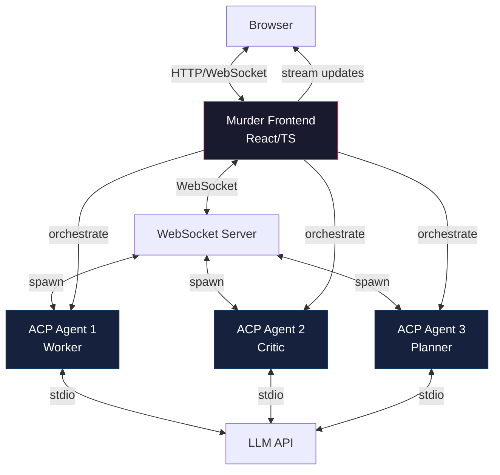

# Strategic Pivot: From Backend Orchestration to Frontend-Native Agent Client

> *"We've been building the backend version of what the frontend should do natively. The AgentClient pattern is beautiful, but it's solving the wrong problem."*

---

## 🧭 Where We Are

We've spent the night building something genuinely novel: **multi-agent iterative refinement over stdio JSON-RPC**. We proved that:
- Agents can spawn agents
- Session IDs can be unified across child processes
- Tool calls can be intercepted and transformed into workflows
- The ACP protocol is flexible enough to support meta-agents

But we're at a crossroads. The question isn't "can we build AgentClient in Python?" It's "**should we?**"

---

## 🤔 The Realization

### What We Built
```
Zed → AcpAgent (Python) → LLM → Tool Call → 
  Intercept → Spawn Worker/Critic (Python) → 
  Stream Updates → Return Result → LLM → end_turn
```

### What the Frontend Could Do
```
Browser → Murder Frontend (JS/TS) → WebSocket → ACP Agent → LLM → Tool Call →
  Intercept → Spawn Worker/Critic (Python via WebSocket) →
  Stream Updates → Return Result → LLM → end_turn
```

**The pattern is identical.** The only difference is the transport layer. We've been building the backend version of what should be a frontend-native capability.

---

## 🎯 The Strategic Insight

### Frontend-Native Agent Client Advantages

1. **Independent Agent Spawning**
   - Frontend can spawn N separate ACP agent processes
   - Each agent gets its own WebSocket connection
   - No stdio multiplexing complexity
   - Cancel any agent independently

2. **Rich UI Capabilities**
   - Monaco editor for diffs
   - xterm.js for terminal representation
   - Real-time streaming with proper UI feedback
   - Cancellation buttons on each terminal
   - Agent status indicators (worker/critic labels)

3. **Progressive Disclosure**
   - Start simple: single agent, basic UI
   - Add complexity: multi-agent workflows, advanced UI
   - No need to refactor backend for frontend features

4. **Decoupled Architecture**
   - Backend: Pure ACP agent implementation
   - Frontend: Agent orchestration, UI, state management
   - Clear separation of concerns
   - Easier to test, debug, and maintain

### The ChainAgent Reconsideration

The `ChainAgent` pattern from `murder/server/chain_agent.py` was more valid than I gave credit for:
- Sequential agent chains
- State management between agents
- Unified session ID forwarding
- Client method delegation

It's essentially what AgentClient does, but designed for the frontend to orchestrate.

---

## 🏗️ The New Architecture Vision



### Frontend Responsibilities
- Agent lifecycle management (spawn, monitor, kill)
- Session ID unification
- Tool call interception
- Multi-agent workflow orchestration
- Rich UI (Monaco, xterm.js, real-time streaming)
- State management (agent status, conversation history)

### Backend Responsibilities
- Pure ACP agent implementation
- LLM integration
- Tool execution
- Session state persistence
- No orchestration logic

---

## 🔧 Technical Implementation Plan

### Phase 1: Database Refactoring
**Goal:** Simplify compaction with agent-aware schema

```sql
-- Current: session_id is the only key
sessions(session_id, created_at, ...)

-- Proposed: agent-aware schema
sessions(session_id, created_at, ...)
agents(
  agent_id TEXT PRIMARY KEY,        -- "{session_id}-{agent_idx}"
  session_id TEXT REFERENCES sessions(session_id),
  agent_idx INTEGER,                 -- 0, 1, 2...
  role TEXT,                         -- "worker", "critic", "planner"
  status TEXT,                       -- "active", "completed", "cancelled"
  created_at TIMESTAMP
)
```

**Benefits:**
- Track multiple agents per session
- Simplify compaction (compact per-agent, not per-session)
- Clear agent lifecycle management
- Drop the hash suffix on cool names

### Phase 2: Frontend Agent Client
**Goal:** Build native agent orchestration in TypeScript

```typescript
class AgentClient {
  async spawnAgent(config: AgentConfig): Promise<AgentSession>
  async sendPrompt(sessionId: string, prompt: string): Promise<void>
  async cancelAgent(sessionId: string): Promise<void>
  onSessionUpdate(callback: (update: SessionUpdate) => void): void
}

class AgentOrchestrator {
  async runRefinement(task: string, criteria: string[]): Promise<string>
  // Spawns worker/critic, manages their lifecycle
  // Streams updates to UI
  // Returns consolidated result
}
```

### Phase 3: UI Implementation
**Goal:** Trae Solo-level polish

- Monaco editor for code diffs
- xterm.js for terminal representation
- Real-time streaming with agent labels
- Cancellation buttons per terminal
- Agent status indicators
- Conversation history with agent attribution

### Phase 4: Advanced Features
- AST parsing with pytree-sitter (not just watchdog)
- Progressive disclosure (start simple, add complexity)
- Multi-agent workflows (planner → worker → critic)
- State persistence across sessions

---

## 📊 Decision Matrix

| Approach | Complexity | UI Capabilities | Scalability | Maintenance |
|----------|------------|-----------------|-------------|-------------|
| Backend AgentClient (Python) | High | Limited (stdio) | Medium | High |
| Frontend Agent Client (JS/TS) | Medium | Rich (Monaco/xterm) | High | Medium |
| Hybrid (MCP + Frontend) | Low | Medium | High | Low |

**Recommendation:** Frontend Agent Client. It's the right layer for orchestration, gives us the UI we want, and keeps the backend simple.

---

## 🎨 The Vision: Murder UI

### What We Want (Trae Solo Inspired)
- Clean, dark interface
- Grid of task cards (like Trae's "More than Coding")
- Monaco editor for code diffs
- xterm.js terminals with cancel buttons
- Agent status indicators (worker/critic/planner)
- Real-time streaming with proper UI feedback
- Progressive disclosure (start simple, add features)

### What We Have Now
- Basic terminal output
- No code editor
- No agent attribution
- Limited UI feedback
- Backend-heavy architecture

### The Gap
We need to move orchestration from Python to TypeScript, build rich UI components, and create a proper frontend agent client. The backend should just be ACP agents doing their thing.

---

##  Next Steps

1. **Pause AgentClient work** - It's solving the wrong problem
2. **Refactor database** - Add agent table, simplify compaction
3. **Design frontend architecture** - AgentClient in TypeScript
4. **Build UI components** - Monaco, xterm.js, streaming
5. **Implement orchestration** - Frontend-native agent spawning
6. **Test end-to-end** - Multi-agent workflows with rich UI

---

## 📝 Author Note

This pivot isn't a retreat. It's a **strategic realignment**. We've proven the multi-agent pattern works. Now we need to put it where it belongs: in the frontend, where users can see it, interact with it, and benefit from it.

The backend should be simple, reliable, and focused on ACP protocol compliance. The frontend should be rich, interactive, and handle orchestration. That's the separation of concerns that will let us build something truly great.

**Session Reference:** `gregarious-elusive-petrel-of-fortitude-48414b`  
**Database:** `/home/thomas/src/crow-ai/crow-cli/sandbox/repl-agent/.crow/crow.db`  
**Log File:** `/home/thomas/src/crow-ai/crow-cli/sandbox/repl-agent/.crow/logs/crow-cli-gregarious-elusive-petrel-of-fortitude-48414b.log`

---

## 💭 Final Thoughts

The Trae Solo screenshot you shared? That's the bar. We can get there. But not by overcomplicating the backend. By building a frontend that's as smart and beautiful as the agents it orchestrates.

Let's pause, refactor, and build it right. The foundation is solid. Now let's make it shine. ✨
